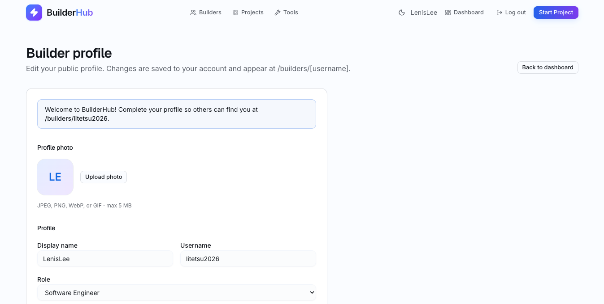
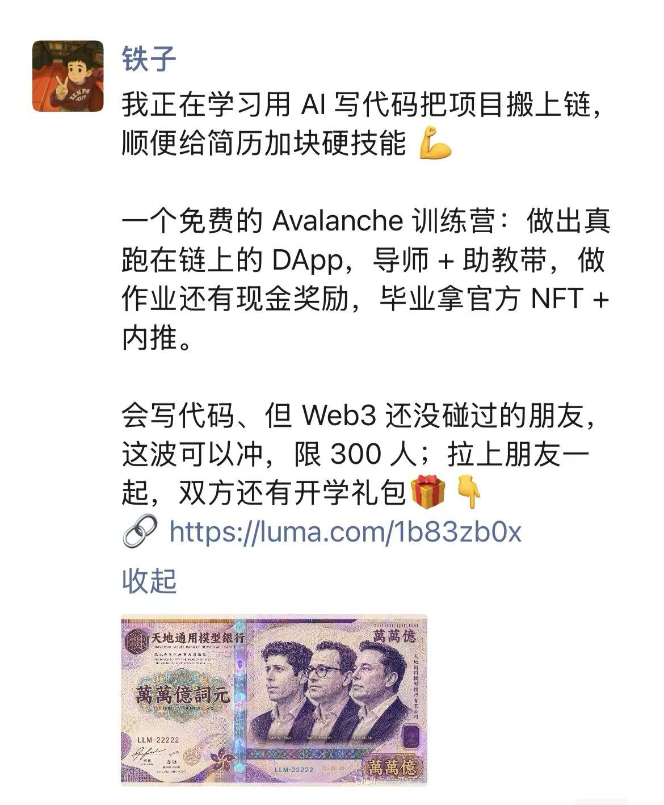

# Task 1：第一章 Avalanche 零基础入门知识

> 对应课程：第一章
> 截止提交：9 月 6 日 24:00:00 (UTC+8)

## 任务一：注册 BuilderHub

已完成 [BuilderHub](https://build.avax.network/?ref=ZETMV&utm_source=team1) 注册并登录，Builder profile 页面如下。

- BuilderHub 地址：https://build.avax.network
- Display name：LenisLee
- Username：litetsu2026
- 注册状态：✅ 已完成

## 任务二：转发课程报名链接

已将课程报名链接转发至微信朋友圈，文案取自 [转发模板](/public/转发模板.md)。

- 转发平台：微信朋友圈
- 微信昵称：铁子（即本人，GitHub 用户名 LenisLee）
- 报名链接：https://luma.com/1b83zb0x
