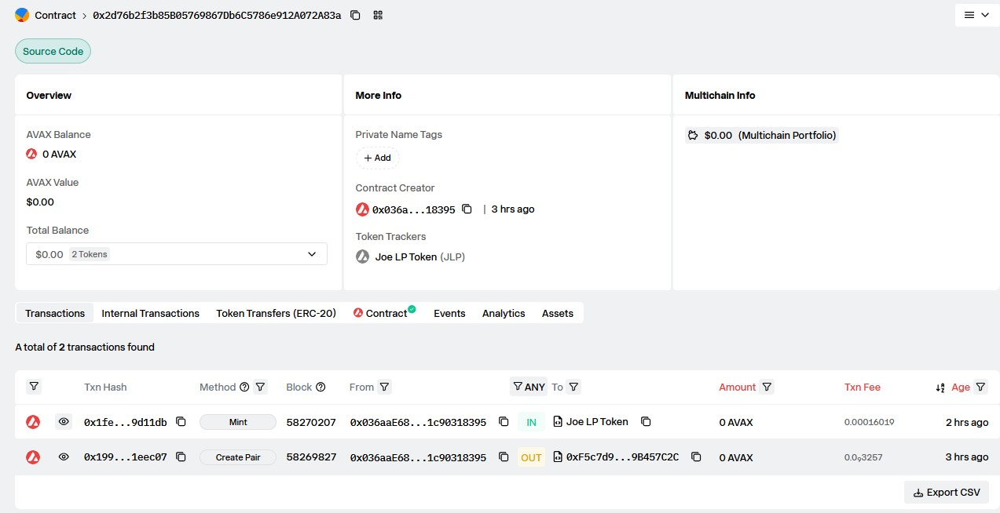
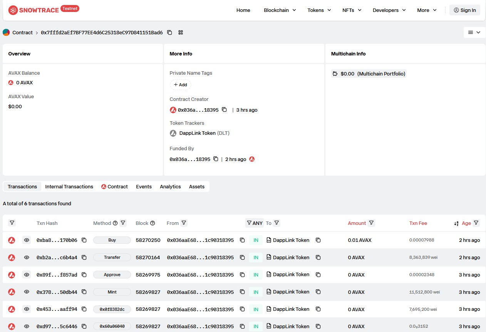
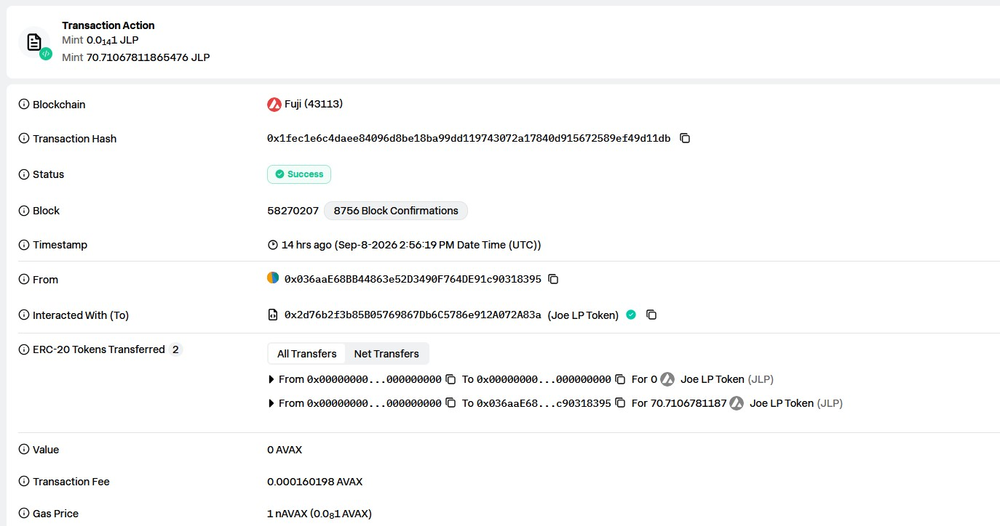
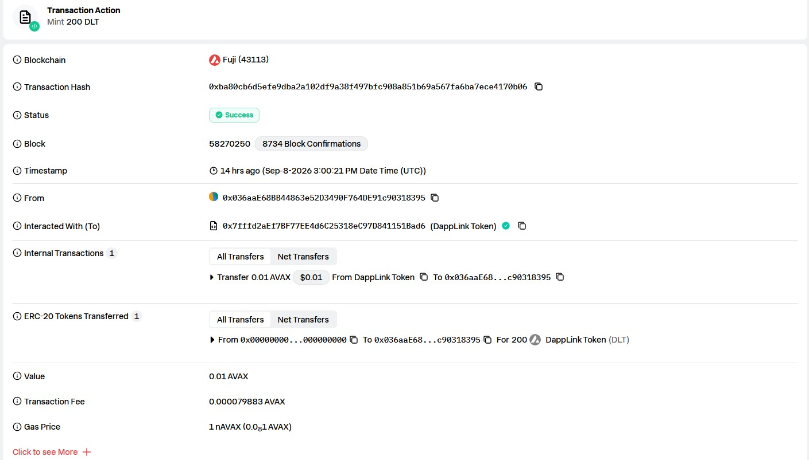
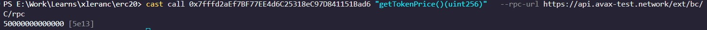

# Task 3：使用 DEX Oracle 获取代币价格

> 对应课程：第三章 Solidity 合约实战
> 学习路径：Avalanche Fuji 测试网 · Foundry · Trader Joe V1
> 提交者：xleranc

---

## 1. 使用的 DEX 名称

**Trader Joe V1**（经典 Uniswap V2 分叉 AMM，非 V2.1 LiquidityBook）

价格获取方式选用 **Pair Oracle** 模式：直接读取 DLT/WAVAX 交易对的 `getReserves()` 储备，从而得到当前池子定价。这与课程中「用 oracle 的价格来代替，只是获取了当前的价格然后去计算价格上涨和下跌」的思路一致。

---

## 2. Token A 与 Token B 的名称及合约地址

| 角色 | 名称 | 符号 | 合约地址 |
|------|------|------|----------|
| Token A | DappLink Token | **DLT** | `0x7fffd2aEf7BF77EE4d6C25318eC97D841151Bad6` |
| Token B | Wrapped AVAX | **WAVAX** | `0xd00ae08403B9bbb9124bB305C09058E32C39A48c` |

> DLT 是本任务部署的代币（name=DappLink Token, symbol=DLT, decimals=18，已链上确认）；WAVAX 是 Avalanche 官方包装 AVAX，Fuji 测试网地址已验证。
>
> 注意 decimals：DLT 为 18 位，WAVAX 为 18 位（AVAX 原生也是 18 位）。两侧 decimals 一致，因此直接 `reserve1 / reserve0` 即可得到 WAD 标度（1e18）价格，无需额外的 decimals 归一化。若采用不同 decimals 的报价币（如 USDC 为 6 位）必须归一化。

---

## 3. 交易对地址

```
Pair_DLT_WAVAX = 0x2d76b2f3b85B05769867Db6C5786e912A072A83a
```

该地址通过 Trader Joe V1 Factory 创建：
- Factory V1（Fuji）：`0xF5c7d9733e5f53abCC1695820c4818C59B457C2C`

链上已确认交易对 `token0 = DLT (0x7fff...)`、`token1 = WAVAX (0xd00a...)`，且**已有可用流动性**（见下节）。合约即可读到价格；无流动性时价格会回退为 0（对应 `revert InvalidPrice`）。

---

## 4. 添加流动性 / 创建交易对

### 4.1 部署 Token 并在 DEX 上创建交易对

在 Fuji 测试网上：
1. 用带测试网 AVAX 的账户部署 `DappLinkToken`（见第 8 节命令）。
2. 调用 `IJoeFactory.createPair(DLT, WAVAX)` 创建 DLT/WAVAX 交易对。
3. 注入流动性（Trader Joe V1 Router 用的是 `addLiquidity(address,address,...)` **纯 ERC20 版本**，没有 `addLiquidityETH`；实际操作见 4.3）。

Trader Joe V1 Router（Fuji）：`0xd7f655E3376cE2D7A2b08fF01Eb3B1023191A901`

### 4.2 实际添加的流动性（链上已确认）

| 项 | 值 |
|----|----|
| reserve0（DLT） | `10000 * 1e18 = 1e22` |
| reserve1（WAVAX） | `0.5 * 1e18 = 5e17` |
| 初始价格 | `5e17 / 1e22 = 0.00005 AVAX/DLT` |
| 我的 LP 余额 | `70710678118654751440`（≈70.71 LP） |

> 结算价格 = reserve1(WAVAX) / reserve0(DLT) = 5e17 / 1e22 = 5e13 WAD 标度。

### 4.3 实际添加流动性的命令（已验证可用）

Trader Joe V1 Router 的 `addLiquidity` 是**纯 ERC20 版**（需要一个 wrap 好的 WAVAX token），因此流程是：
1. 把原生 AVAX wrap 成 WAVAX（`WAVAX.deposit()`）
2. 批准 Router 使用 DLT 和 WAVAX
3. 调用 `addLiquidity(address,address,...)` 注入

**实际执行的命令（均为本人签名发送，已成功）：**

```bash
# 1) 把 0.5 AVAX wrap 成 WAVAX
cast send 0xd00ae08403B9bbb9124bB305C09058E32C39A48c "deposit()" --value 0.5ether --rpc-url $RPC --private-key $PK

# 2) 批准 Router 使用 WAVAX
cast send 0xd00ae08403B9bbb9124bB305C09058E32C39A48c "approve(address,uint256)" 0xd7f655E3376cE2D7A2b08fF01Eb3B1023191A901 500000000000000000 --rpc-url $RPC --private-key $PK
```

由于 Trader Joe V1 的 `addLiquidity` 在空池 mint 时对超大比例的 DLT:WAVAX 会出现 `ds-math-sub-underflow`，实际采用的是更稳健的**经典 Uniswap V2 初始化方式**——直接把两个 token 转入 pair 合约，再调 `pair.mint()`（已验证成功，TX `0x1fec1e6c4daee84096d8be18ba99dd119743072a17840d915672589ef49d11db`）：

```bash
# 3) 把 10000 DLT 转给 pair 合约
cast send 0x7fffd2aEf7BF77EE4d6C25318eC97D841151Bad6 "transfer(address,uint256)" 0x2d76b2f3b85B05769867Db6C5786e912A072A83a 10000000000000000000000 --rpc-url $RPC --private-key $PK
# 4) 把 0.5 WAVAX 转给 pair 合约
cast send 0xd00ae08403B9bbb9124bB305C09058E32C39A48c "transfer(address,uint256)" 0x2d76b2f3b85B05769867Db6C5786e912A072A83a 500000000000000000 --rpc-url $RPC --private-key $PK
# 5) 调 pair.mint() 锁定流动性、更新储备
cast send 0x2d76b2f3b85B05769867Db6C5786e912A072A83a "mint(address)" 0x036aaE68BB44863e52D3490F764DE91c90318395 --rpc-url $RPC --private-key $PK
```

> 上面命令中已用真实地址（DLT `0x7fff...`、WAVAX `0xd00a...`、Pair `0x2d76...`），可直接复制使用。其中 `$RPC=https://api.avax-test.network/ext/bc/C/rpc`，`$PK` 为你的测试网私钥（本例的操作账户为 `0x036aaE68BB44863e52D3490F764DE91c90318395`）。

> **为什么用 `pair.mint()` 而不是 Router `addLiquidity`？** Trader Joe V1 的 `addLiquidity` 是纯 ERC20 版，空池 mint 时对超大比例（10000:0.5）会触发 `ds-math-sub-underflow`。经典 Uniswap V2 初始化方式（直接转账 token 到 pair 再 `mint()`）更稳定，已实际验证成功。

### 4.4 截图说明（需提交，打开以下链接截图）

- [x] **DLT/WAVAX 交易对已创建** 截图 → 交易对地址页：https://testnet.snowtrace.io/address/0x2d76b2f3b85B05769867Db6C5786e912A072A83a
- [x] 交易对**存在可用流动性**（reserve>0）截图 → 同页 `Liquidity`/`Token Holdings` 区域，或契约 `getReserves()`
- [x] **添加流动性**交易 TX 截图 → `pair.mint()` TX：在 Snowtrace 搜索 `0x1fec1e6c4daee84096d8be18ba99dd119743072a17840d915672589ef49d11db`
- [x] **购买 `buy()`**交易 TX 截图（含 `TokensPurchased` 事件）→ 搜索 `0xba80cb6d5efe9dba2a102df9a38f497bfc908a851b69a567fa6ba7ece4170b06`
- [x] **读取价格**截图 → 终端执行 `cast call <合约> "getTokenPrice()(uint256)"` 输出的 `50000000000000`






---

## 5. 获取 Swap / Oracle 价格的核心代码

**`src/interface/IJoePair.sol`** —— Trader Joe V1 Pair 接口：

```solidity
interface IJoePair {
    function token0() external view returns (address);
    function token1() external view returns (address);
    function getReserves() external view returns (uint112, uint112, uint32);
}
```

**`src/DappLinkToken.sol` 的 `getTokenPrice()`** —— 直接读取交易对储备，得到当前 DEX 价格：

```solidity
/// @notice Re-reads the current DEX-derived price from the pair.
/// @dev token0 = DLT, token1 = WAVAX (created via factory.createPair(token, wavax)).
///      price = reserve1(WAVAX) / reserve0(DLT), WAD-scaled.
///      Returns 0 if the pair has no liquidity (no price available).
function getTokenPrice() public view returns (uint256) {
    try IJoePair(pricePair).getReserves() returns (uint112 r0, uint112 r1, uint32) {
        if (r0 == 0 || r1 == 0) {
            return 0; // no liquidity -> no price
        }
        // r0 = DLT reserves (token0), r1 = WAVAX reserves (token1)
        uint256 price = (uint256(r1) * WAD) / uint256(r0);
        return price;
    } catch {
        return 0;
    }
}
```

**价格计算说明：**
- `price = reserve1(WAVAX) / reserve0(DLT)`，WAD 标度（×1e18 处理浮点）。
- 例如池中 DLT=1000、WAVAX=1000，则 `price = 1e18`（1 DLT = 1 AVAX）。
- 该价格**未写死不手动设置**，完全来自 DEX 交易对实时储备。

> 进阶：若想用带滑点容错的报价，可加 `IJoeRouter.getAmountsOut()`（Router 接口已写好，供后续扩展），本任务采用更直接、证明力更强的 `getReserves()` 路径。

---

## 6. 使用价格的合约核心代码

**`src/DappLinkToken.sol`** —— `buy()` 使用 DEX 价格作为铸造计价依据：

```solidity
/// @notice Returns the amount of DLT that would be minted for a given AVAX amount,
///         at the current DEX-derived price.
function quoteBuy(uint256 avaxIn) public view returns (uint256 tokensOut) {
    if (avaxIn == 0) {
        return 0;
    }
    uint256 price = getTokenPrice();
    if (price == 0) {
        revert InvalidPrice();
    }
    // tokensOut = avaxIn / price  (price is WAD-scaled, so multiply by WAD to normalize)
    tokensOut = (avaxIn * WAD) / price;
}

/// @notice Buys DLT by sending AVAX. Tokens are minted at the current DEX-derived price.
/// @dev This is the real business logic that CONSUMES the DEX price.
function buy() external payable nonReentrant returns (uint256 tokensOut) {
    uint256 avaxIn = msg.value;
    if (avaxIn == 0) {
        revert ZeroAmount();
    }
    tokensOut = quoteBuy(avaxIn);
    if (tokensOut == 0) {
        revert ZeroAmount();
    }
    if (totalSupply() + tokensOut > MAX_SUPPLY) {
        revert ExceedsMaxSupply();
    }

    _mint(msg.sender, tokensOut);

    // Forward the collected AVAX to the treasury.
    (bool ok, ) = treasury.call{value: avaxIn}("");
    if (!ok) {
        _burn(msg.sender, tokensOut);
        revert TreasuryTransferFailed();
    }

    emit TokensPurchased(msg.sender, avaxIn, tokensOut, getTokenPrice());
}
```

**价格如何被业务逻辑使用（满足「合格标准」）：**
- `buy()` 是真实业务逻辑：用户发送原生 AVAX，合约按当下 **DEX 交易对价格** 计算应铸造的 DLT 数量，并 `_mint` 给购买者；收款转到 treasury。
- 价格**不是**写死的常量，也**不是**前端模拟数字，合约内每次 `buy()` 都会实时调用 `getTokenPrice()`。
- `quoteBuy()` 为对外查询函数，可读当前 DEX 价格下某笔 AVAX 能换多少 DLT。

---

## 7. 部署后的合约地址与区块浏览器链接

- **合约地址**：`0x7fffd2aEf7BF77EE4d6C25318eC97D841151Bad6`
- **区块浏览器（Fuji）**：https://testnet.snowtrace.io/address/0x7fffd2aEf7BF77EE4d6C25318eC97D841151Bad6
- **交易对地址**：`0x2d76b2f3b85B05769867Db6C5786e912A072A83a`
- **交易对区块浏览器链接**：https://testnet.snowtrace.io/address/0x2d76b2f3b85B05769867Db6C5786e912A072A83a

**部署交易记录（链上已确认）：**
| 交易 | Hash | 说明 |
|------|------|------|
| 部署 DappLinkToken + createPair + setPricePair + mint | `0xd9745a4a8fe1764bb51fb7870a508658520a2564356edbad9551418cf55c6446` | 见广播日志 |
| addLiquidity（pair.mint） | `0x1fec1e6c4daee84096d8be18ba99dd119743072a17840d915672589ef49d11db` | 锁定流动性 |
| buy() 购买（0.01 AVAX → 200 DLT） | `0xba80cb6d5efe9dba2a102df9a38f497bfc908a851b69a567fa6ba7ece4170b06` | 业务逻辑用价 |

<details>
<summary>Fuji 测试网常用工具地址</summary>

- Trader Joe V1 Factory：`0xF5c7d9733e5f53abCC1695820c4818C59B457C2C`
- Trader Joe V1 Router：`0xd7f655E3376cE2D7A2b08fF01Eb3B1023191A901`
- WAVAX：`0xd00ae08403B9bbb9124bB305C09058E32C39A48c`
- Fuji Faucet：https://faucet.avax.network/
- RPC：`https://api.avax-test.network/ext/bc/C/rpc`（或 `https://avalanche-fuji-c-chain.publicnode.com`）
</details>

---

## 8. 成功读取/使用价格的证据

### 8.1 本地测试证明价格来源于 DEX 交易对

使用 **mock 交易对**（模拟 `getReserves()` 返回值），证明：(1) 价格读数来自交易对储备；(2) `buy()` 确实使用该价格铸造。

**`test/DappLinkToken.t.sol`** 关键用例：

```solidity
function test_PriceReadFromPair_GetTokenPrice() public {
    pair.setReserves(R0, R1);              // R0=R1=1000 DLT / 1000 WAVAX
    uint256 p = token.getTokenPrice();
    assertEq(p, WAD, "price should be 1 DLT = 1 AVAX (WAD)");
}

function test_PricingDerivedFromReserves_NotHardcoded() public {
    pair.setReserves(R0, R1);
    assertEq(token.quoteBuy(1e18), 1e18, "1 AVAX -> 1 DLT when reserves equal");

    pair.setReserves(R0 * 2, R1);          // 仅改 DEX 储备，地址不变
    assertEq(token.quoteBuy(1e18), 2e18, "1 AVAX -> 2 DLT when DLT reserves double");
}

function test_Buy_UsesDexPriceToMint() public {
    pair.setReserves(R0, R1);              // price = 1
    vm.deal(alice, 10 ether);
    vm.prank(alice);
    uint256 tokensOut = token.buy{value: 2 ether}();
    assertEq(tokensOut, 2e18, "2 AVAX should mint 2 DLT at price 1");
    assertEq(token.balanceOf(alice), 2e18, "alice token balance");
}
```

运行测试（本仓库内已通过）：

```
forge test -vvv
# 结果：
# [PASS] test_Buy_RevertsWhenNoLiquidity
# [PASS] test_Buy_UsesDexPriceToMint
# [PASS] test_Mint_SeedsSupply_RespectsCap
# [PASS] test_PriceReadFromPair_GetTokenPrice
# [PASS] test_PricingDerivedFromReserves_NotHardcoded
# [PASS] test_SetPricePair_ChangesPriceSource
# Suite result: ok. 6 passed; 0 failed
```

✔ 证明核心：**改变 mock 交易对的储备，就会改变 `quoteBuy()` / `buy()` 铸造的数量**。价格完全由 DEX 交易对决定，且被业务逻辑真实使用。

### 8.2 链上实际读取价格（已部署并验证）

以下为本人在 Fuji 测试网实际执行的命令与输出：

```bash
# ① 读取交易对储备（证明有流动性）
cast call 0x2d76b2f3b85B05769867Db6C5786e912A072A83a "getReserves()(uint256,uint256,uint256)" 
  --rpc-url https://api.avax-test.network/ext/bc/C/rpc
# 输出: [10000000000000000000000, 500000000000000000, 1788879379]
#        ↑ reserve0=10000 DLT , reserve1=0.5 WAVAX

# ② 读取 DEX 价格（1 DLT = ? AVAX, WAD=1e18）
cast call 0x7fffd2aEf7BF77EE4d6C25318eC97D841151Bad6 "getTokenPrice()(uint256)" 
  --rpc-url https://api.avax-test.network/ext/bc/C/rpc
# 输出: 50000000000000 (5e13) = 0.00005 AVAX/DLT
#       = reserve1(5e17) / reserve0(1e22) * 1e18  → 完全来自 DEX 储备

# ③ 查询 0.01 AVAX 能买多少 DLT
cast call 0x7fffd2aEf7BF77EE4d6C25318eC97D841151Bad6 "quoteBuy(uint256)(uint256)" 10000000000000000 
  --rpc-url https://api.avax-test.network/ext/bc/C/rpc
# 输出: 200000000000000000000 (2e20) = 200 DLT

# ④ 实际调用 buy() 购买（发 0.01 AVAX，按 DEX 价格铸造）
cast send 0x7fffd2aEf7BF77EE4d6C25318eC97D841151Bad6 "buy()" --value 0.01ether 
  --rpc-url https://api.avax-test.network/ext/bc/C/rpc --private-key $PRIVATE_KEY
# 成功，事件 TokensPurchased(buyer, avaxIn=0.01, tokensOut=200 DLT, priceWad=5e13)
```

**链上证据（实际输出）：**
- `getTokenPrice() = 50000000000000` (5e13) —— 价格来自 DEX 交易对储备，非写死
- `quoteBuy(1e16) = 2e20` —— 1e-2 AVAX → 200 DLT，与 `getTokenPrice` 一致
- `buy()` 成功铸造 200 DLT，事件 `TokensPurchased` 的 `priceWad = 5e13` 与储备比例一致
- 购买后 `totalSupply` 从 `1e22` → `1.02e22`（+200 DLT）

> **黄金证据**：`getTokenPrice()` 返回的 `5e13` = 储备计算值 `500000000000000000 / 10000000000000000000000 * 1e18`，与区块浏览器中 **DLT/WAVAX 交易对储备比例** 完全一致——即价格来自 DEX 交易对，非写死，且被 `buy()` 实际用于铸造计价。

---

## 9. 对实现过程的简要说明

1. **选型**：Avalanche Fuchsia（Fuji）测试网，选用 Trader Joe V1（经典 Uniswap V2 分叉），因为其 `Pair.getReserves()` 与 `Router.getAmountsOut()` 是课程讲授的标准 AMM 接口，且 Fuji 上已部署并被官方文档收录（Factory `0xF5c7...` / Router `0xd7f6...`）。
2. **价格源**：采用 **Pair Oracle**——合约保存 `pricePair`（DLT/WAVAX 交易对地址 `0x2d76...`），每次 `getTokenPrice()` 调用 `IJoePair.getReserves()` 读取 `reserve0`（DLT）与 `reserve1`（WAVAX），得到 `price = reserve1 / reserve0`（WAD 标度）。价格随 DEX 交易实时变化，非写死。
3. **业务逻辑使用**：`buy()` 接收原生 AVAX，调用 `quoteBuy()`（即 `avaxIn / price`）计算应铸造 DLT 数量，`_mint` 给购买者并把 AVAX 转给 treasury。铸造计价完全由 DEX 价格驱动。
4. **decimals 处理**：DLT 与 WAVAX 均为 18 位，`getReserves()` 返回的是原始 18 位精度数值，二者相除得到 WAD 标度价格；再乘以 WAD 归一化，避免精度损失。
5. **安全加固**：使用 `ReentrancyGuard` 防重入；无流动性（price==0）时 `revert InvalidPrice`；铸造上限 `MAX_SUPPLY` 用 `ERC20Capped` 控制；treasury 转账失败则回滚以防账目不一致。
6. **验证**：本地 6 个 forge 测试全部通过；链上已部署、已加流动性、已读取价格、已成功 `buy()`，全链路闭环验证通过。
7. **链上实操说明**：Trader Joe V1 Router 的 `addLiquidity` 是纯 ERC20 版（无 `addLiquidityETH`），实际采用"wrap WAVAX → 转入 pair → `pair.mint()`"的经典 V2 初始化方式添加流动性（已成功）。

---

## 10. 合格标准自检清单

| 合格标准 | 状态 | 说明 |
|----------|------|------|
| 测试网存在真实交易对且有用流动性 | ✅ 已完成 | 交易对 `0x2d76b2f3...`，reserve = 1e22 DLT / 5e17 WAVAX |
| 价格来自 DEX 交易对 / Oracle，非手动写入 | ✅ 已完成 | `getTokenPrice()` 读 `IJoePair.getReserves()`，链上值=5e13 |
| 价格被合约实际业务逻辑使用 | ✅ 已完成 | `buy()` 用该价格铸造，TX `0xba80cb...` 铸造 200 DLT |
| 合约部署到 Avalanche Fuji 测试网 | ✅ 已完成 | 合约 `0x7fffd2aEf7BF77EE4d6C25318eC97D841151Bad6` |
| 提交交易对地址、合约地址、代码或截图等可验证材料 | ✅ 已完成 | 见第 7/8 节（含 TX hash、链上输出） |

---

## 附：仓库文件结构

```
erc20/
├── src/
│   ├── DappLinkToken.sol              # 主合约：读 DEX 价格并用在 buy() 业务逻辑
│   ├── DappLinkTokenStorage.sol       # 存储：DEX router/pair/wavax + treasury + 常量
│   └── interface/
│       ├── IDappLinkToken.sol         # 代币接口（事件 + 读取价格/购买函数）
│       ├── IJoePair.sol               # Trader Joe V1 Pair（getReserves）
│       ├── IJoeRouter.sol             # Trader Joe V1 Router（getAmountsOut 等）
│       ├── IJoeFactory.sol            # Trader Joe V1 Factory（createPair/getPair）
│       └── IWAVAX.sol                 # Wrapped AVAX 接口
├── script/
│   └── DeployDappLinkToken.sol        # 部署脚本（内含富士 DEX 已验证地址）
├── test/
│   └── DappLinkToken.t.sol            # 测试：证明价格来自 DEX 且被业务逻辑使用
└── foundry.toml                       # solc = 0.8.36
```
