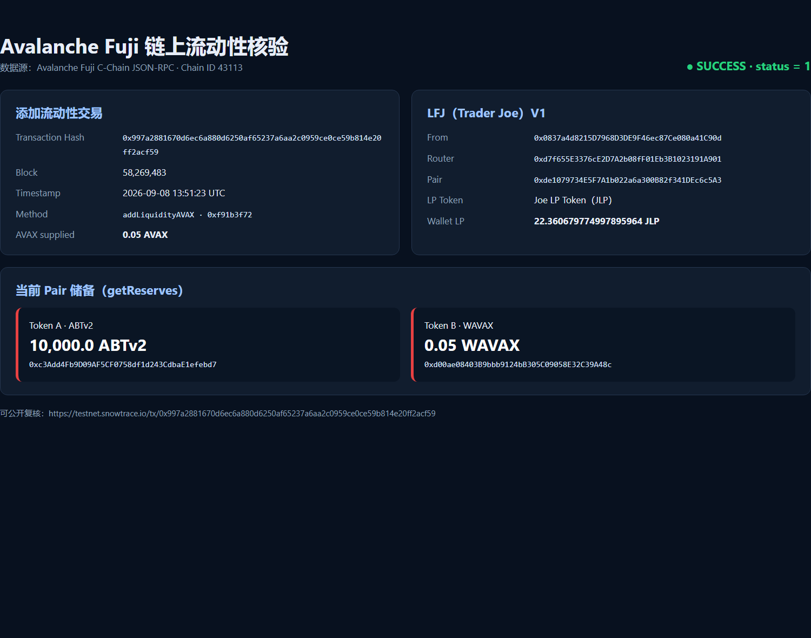
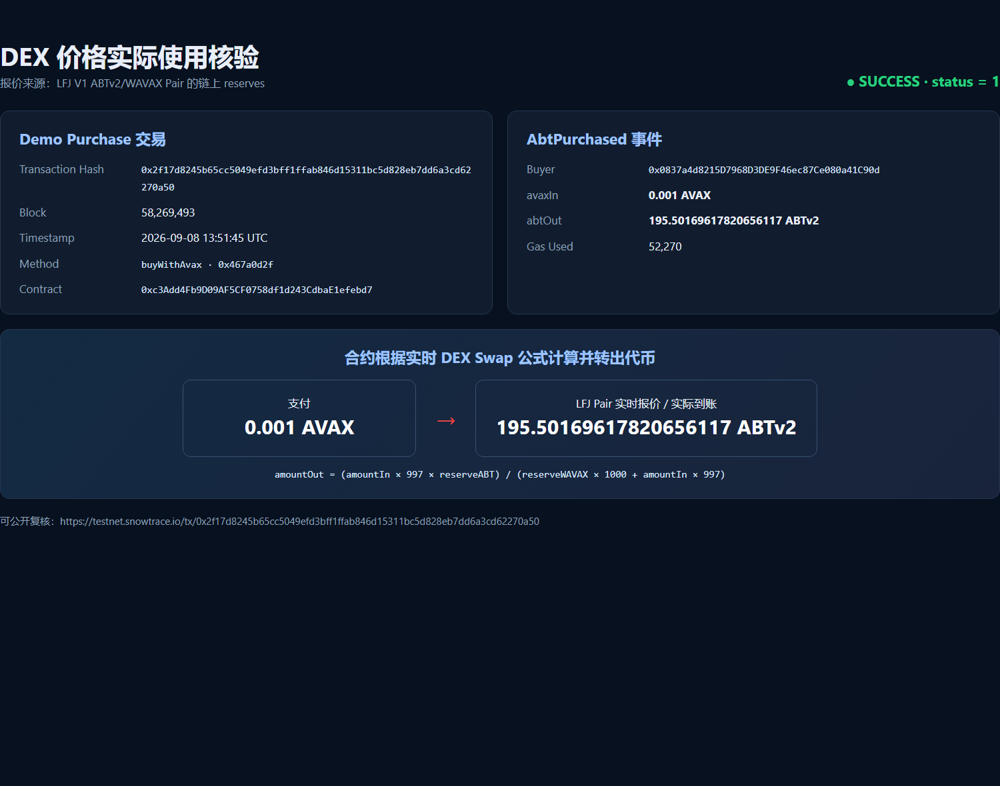

# Task 3：使用 DEX Oracle 获取代币价格

> 对应课程：第三章 Solidity 合约实战

## 任务成果

本任务使用 **LFJ（原 Trader Joe）V1** 的 Avalanche Fuji 测试网 AMM。为升级版 ABT 创建了真实的 `ABTv2 / WAVAX` 交易对并添加流动性；`AvalancheBuilderTokenV2` 从该 Pair 的链上 reserves 计算 LFJ V1 的常数乘积 Swap 报价，并在 `buyWithAvax` 的真实购买逻辑中使用报价。

| 项目 | 内容 |
| --- | --- |
| 网络 | Avalanche Fuji Testnet（chainId `43113`） |
| DEX | LFJ（Trader Joe）V1 |
| Token A | Avalanche Builder Token V2（ABTv2） [`0xc3Add4Fb9D09AF5CF0758df1d243CdbaE1efebd7`](https://testnet.snowtrace.io/address/0xc3Add4Fb9D09AF5CF0758df1d243CdbaE1efebd7) |
| Token B | Wrapped AVAX（WAVAX） [`0xd00ae08403B9bbb9124bB305C09058E32C39A48c`](https://testnet.snowtrace.io/address/0xd00ae08403B9bbb9124bB305C09058E32C39A48c) |
| ABTv2 / WAVAX Pair | [`0xde1079734E5F7A1b022a6a300B82f341DEc6c5A3`](https://testnet.snowtrace.io/address/0xde1079734E5F7A1b022a6a300B82f341DEc6c5A3) |
| LFJ V1 Factory | [`0xF5c7d9733e5f53abCC1695820c4818C59B457C2C`](https://testnet.snowtrace.io/address/0xF5c7d9733e5f53abCC1695820c4818C59B457C2C) |
| LFJ V1 Router | [`0xd7f655E3376cE2D7A2b08fF01Eb3B1023191A901`](https://testnet.snowtrace.io/address/0xd7f655E3376cE2D7A2b08fF01Eb3B1023191A901) |

## 链上证据

| 操作 | 交易 |
| --- | --- |
| ABTv2 部署 | [`Contract Creation`](https://testnet.snowtrace.io/address/0xc3Add4Fb9D09AF5CF0758df1d243CdbaE1efebd7) |
| 授权 LFJ Router 使用 ABTv2 | [`0xcddc...7608b0`](https://testnet.snowtrace.io/tx/0xcddc56d009830456599ce10ee7744c23b3d07e2d6d9335c52ff2bac9ae7608b0) |
| 创建 Pair 并添加流动性 | [`0x997a...2acf59`](https://testnet.snowtrace.io/tx/0x997a2881670d6ec6a880d6250af65237a6aa2c0959ce0ce59b814e20ff2acf59) |
| 将真实 Pair 写入 ABTv2 | [`0x8eb2...33adc5`](https://testnet.snowtrace.io/tx/0x8eb2b072b36156c9219c158926ae30b43be4c8ee4f7f1e5c2f0813ad3333adc5) |
| 铸造出售库存 | [`0x2425...5e2770`](https://testnet.snowtrace.io/tx/0x242573edbc8ed3ea29555ff1e5abdc61497de14750b422de33f10aaa465e2770) |
| 使用 DEX 报价完成购买 | [`0x2f17...270a50`](https://testnet.snowtrace.io/tx/0x2f17d8245b65cc5049efd3bff1ffab846d15311bc5d828eb7dd6a3cd62270a50) |

添加流动性交易调用 LFJ Router 的 `addLiquidityAVAX`。部署后链上读取 Pair 可见：`token0 = ABTv2`、`token1 = WAVAX`，且 reserves 非零。脚本在购买前从 Pair 读取到 `10,000 ABTv2 / 0.05 WAVAX`；向 `buyWithAvax` 支付 `0.001 AVAX` 时，实时计算并实际转出 `195.501696178206561170 ABTv2`。

## 添加流动性截图

下图通过 Avalanche Fuji RPC 核验了添加流动性交易、LFJ V1 Pair 当前 reserves 以及钱包持有的 JLP 数量；交易哈希可在 Snowtrace 中公开复核。



## DEX 价格读取与使用截图

下图核验了 `buyWithAvax` 成功交易和 `AbtPurchased` 事件：合约根据 LFJ Pair 的实时 reserves，将 `0.001 AVAX` 报价并实际兑换为 `195.50169617820656117 ABTv2`。



## 获取价格与业务使用的核心代码

```solidity
function quoteAbtForAvax(uint256 avaxIn) public view returns (uint256) {
    IJoePair joePair = IJoePair(dexPair);
    (uint256 abtReserve, uint256 wavaxReserve) = _abtAndWavaxReserves(joePair, joePair.token0());
    if (abtReserve == 0 || wavaxReserve == 0) revert PairHasNoLiquidity();

    // LFJ V1 的常数乘积 AMM 报价；997/1000 对应 0.3% swap fee。
    uint256 avaxInWithFee = avaxIn * 997;
    return (avaxInWithFee * abtReserve) / (wavaxReserve * 1000 + avaxInWithFee);
}

function buyWithAvax(uint256 minAbtOut) external payable nonReentrant returns (uint256 abtOut) {
    abtOut = quoteAbtForAvax(msg.value); // 价格直接来自已配置的 LFJ Pair
    if (abtOut < minAbtOut) revert InsufficientOutput(minAbtOut, abtOut);
    _transfer(address(this), msg.sender, abtOut); // 报价用于实际出售数量
    emit AbtPurchased(msg.sender, msg.value, abtOut);
}
```

完整实现位于本地 Scaffold-ETH 项目的 `packages/hardhat/contracts/AvalancheBuilderTokenV2.sol`；本地测试已验证 Pair reserve 变化会影响报价和购买的代币数量。

## 实现说明

1. 部署新的 `AvalancheBuilderTokenV2`，它保留 ERC20、Burnable、Ownable，并新增受 `ReentrancyGuard` 保护的 AVAX 购买功能。
2. 调用 Fuji 上 LFJ V1 Router 的 `addLiquidityAVAX`，创建并向 `ABTv2/WAVAX` Pair 注入真实测试网流动性。
3. 添加流动性后才调用 `setDexPair`；该函数验证 Pair 两个 token 与 reserves，避免写入无关或空流动性的地址。
4. `quoteAbtForAvax` 直接读取 `getReserves()`，使用 LFJ V1 的 `x*y=k`、0.3% fee 公式计算报价；没有写死价格。
5. `buyWithAvax` 使用此链上报价决定向买家转出的 ABTv2 数量。最后一笔 Demo purchase 已成功上链，可在上述交易中核验。

> 学习用途提示：AMM 即时 reserve 价格可能被单笔交易操纵；生产场景应加上 TWAP、预言机或价格偏离保护。
